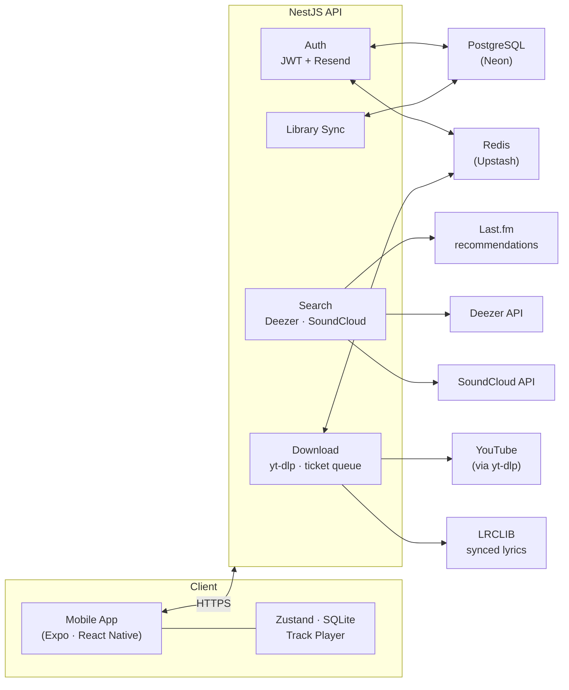

<div align="center">

# EXØS

**Aggregated music player — search, stream and download from multiple sources.**

[](https://expo.dev)
[](https://reactnative.dev)
[](https://nestjs.com)
[](#)


</div>

---

## What is EXØS

EXØS is a cross-platform mobile music player that aggregates tracks from **Deezer** and **SoundCloud**, downloads full audio via **yt-dlp**, and stores it locally for offline playback. Think of it as a self-hosted music client with cloud sync, synced lyrics, and smart recommendations.

## Features

- **Multi-source search** — query Deezer and SoundCloud catalogs from a single search bar
- **Full track downloads** — audio fetched via yt-dlp through a ticket-based queue system
- **Offline playback** — downloaded tracks play instantly with no internet required
- **Synchronized lyrics** — timed lyrics fetched from LRCLIB API, even for SoundCloud tracks if they're somewhat popular
- **Recommendations** — "Because you listened to…" powered by Last.fm similar tracks
- **Cloud library sync** — backed-up downloads and play history synced to your account
- **Playlists** — create local playlists, bulk-add tracks, manage your library
- **Dynamic accent color** — player UI tinted with the dominant album cover color
- **Offline mode** — full app access without an account (no sync, no profile)
- **i18n** — English and Russian

## Tech Stack

### Frontend — `apps/mobile`

| Layer      | Technology                                                                      |
| ---------- | ------------------------------------------------------------------------------- |
| Framework  | React Native 0.81 · Expo SDK 54 (New Architecture)                             |
| Navigation | Expo Router (file-based)                                                        |
| State      | Zustand                                                                         |
| Audio      | react-native-track-player                                                       |
| UI         | Custom components · Solar Icons · Jost font family                            |
| Animations | react-native-reanimated                                                         |
| Lists      | @shopify/flash-list                                                             |
| Storage    | expo-sqlite (local DB) · expo-secure-store (tokens) · AsyncStorage (settings) |

### Backend — `apps/api`

| Layer     | Technology                                                 |
| --------- | ---------------------------------------------------------- |
| Framework | NestJS                                                     |
| Database  | PostgreSQL (Neon)                                          |
| Cache     | Redis (Upstash)                                            |
| Auth      | JWT access/refresh tokens · email verification via Resend |
| Download  | yt-dlp with concurrency limits and ticket queue            |
| APIs      | Deezer · SoundCloud · Last.fm · LRCLIB                  |

### Landing Page — `apps/web`

| Layer      | Technology                              |
| ---------- | --------------------------------------- |
| Framework  | Next.js 16 (App Router)                 |
| UI         | Tailwind CSS 4 · shadcn/ui · Radix UI |
| Animations | Motion (Framer Motion)                  |
| Icons      | Lucide React                            |
| i18n       | next-intl                               |

> **Note:** The landing page is a standalone marketing site with no integration to the mobile app or API. It serves as a promotional page only — authentication, music playback, and all app features exist exclusively in `apps/mobile`.

### Infrastructure

| Component | Technology                  |
| --------- | --------------------------- |
| Database  | Neon (serverless Postgres)  |
| Cache     | Upstash (serverless Redis)  |
| Email     | Resend                      |
| Builds    | EAS Build                   |
| Monorepo  | pnpm workspaces · Turborepo |
| Linting   | Biome                       |

## Architecture



**Download flow:** Client requests download → API creates a ticket → yt-dlp searches YouTube by track name → audio is transcoded and returned → client saves to device storage and syncs metadata to cloud.

## Getting Started

### Prerequisites

- Node.js 20+
- pnpm 10+
- Android SDK / Xcode (for native builds)
- yt-dlp installed on the server

### Install

```bash
git clone https://github.com/phexuss/exos.git
cd exos
pnpm install
```

### Run the mobile app

```bash
cp apps/mobile/.env.example apps/mobile/.env
cd apps/mobile
npx expo start
```

### Run the API

```bash
cp .env.production.example apps/api/.env
cd apps/api
pnpm dev
```

### Environment Variables

**Mobile** (`apps/mobile/.env`):

```
EXPO_PUBLIC_API_URL=http://localhost:3000/api
```

**API** (`apps/api/.env`):

```
DATABASE_URL=postgresql://...
REDIS_URL=rediss://...
YTDLP_PATH=/usr/bin/yt-dlp
JWT_ACCESS_SECRET=...
JWT_REFRESH_SECRET=...
LASTFM_API_KEY=...
RESEND_API_KEY=...
```

## Project Structure

```
exos/
├── apps/
│   ├── api/          # NestJS backend
│   ├── mobile/       # React Native (Expo) app
│   └── web/          # Landing page (Next.js)
├── turbo.json        # Turborepo config
├── biome.json        # Linter/formatter
└── pnpm-workspace.yaml
```

---

<div align="center">
  <sub>Built by <a href="https://github.com/phexuss">phexuss</a></sub>
</div>
